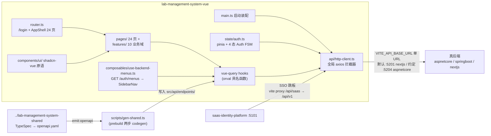
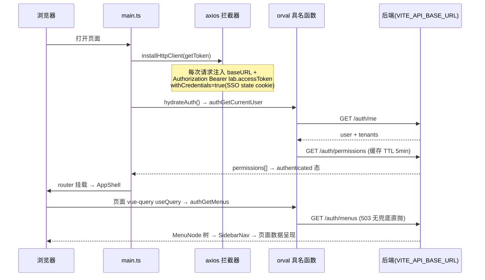

# lab-management-system-vue 架构

> 一句话定位：lab-management-system 多后端家族的 **Vue 前端仓**——react 仓先实现、本仓翻译镜像；只消费契约产物调 API，不实现任何后端 route。

生成日期：2026-09-22 ｜ 锚定 HEAD：776b664 ｜ 生成方式：DeepWiki 风格架构扫描

## 1. 总览

- **家族角色**：前端仓（6 角色中的「前端」）。同一份 shared 契约（dual SSOT：TypeSpec + OpenAPI）由 react/vue/nextjs 三前端 + aspnetcore/springboot/nextjs 多后端各自实现，contract-test 仓黑盒校验，e2e 仓做端到端。本仓与 react 仓是镜像关系（UI 设计 + 字段 schema 以 `../lab-management-system-react/src/` 为镜像来源），不是 fork。
- **双身份**：书稿配套仓（书稿代码块 source of truth）+ harness 门禁仓。功能树账本在 `docs/functions/function-tree.md`：F 级别镜像 shared BASE 26 功能，向下加 I 级子项，状态推进「规划 → 开发中 → 已上线」，每条子项挂 `data-fn` / `@entry` + fnTest；改动功能树走 `/tree-change`（同 commit、废弃只改状态编号不复用）。
- **技术栈**（钉死于 `version-lock.json`）：Vue 3.5 + TypeScript 5.7 + Vite 6 + Vitest 2.1 + Pinia 2.3 + @tanstack/vue-query 5.62 + vue-router 4.5 + Tailwind v4 + shadcn-vue（reka-ui）+ axios；codegen 用 orval 7.5。
- **规模速览**（真实文件统计）：`src/` 323 个 .vue/.ts 文件；`src/pages/` 24 个页面；`src/api/endpoints/` 13 个契约 tag 目录 + 1 个 `model/` schema 目录；`src/features/` 10 个业务域；`tests/` 31 个 .test.ts 文件（app / features / foundation / infrastructure / smoke）。
- **硬约束**：禁止 any / @ts-ignore、Options API、组件内直接 fetch、手写 UI 原语、import shared TS 客户端、运行时切后端（ADR-0014）。
- **顶层目录速览**：`src/`（App.vue、main.ts、router.ts、api/、components/、composables/、data/templates/、features/、lib/、pages/、state/）、`tests/`、`scripts/`、`deploy/`、`docs/`（adr/、conventions/、design/、functions/、requirements/）、`Dockerfile`、`nginx.conf`、`orval.config.ts`、`version-lock.json`。

## 2. 系统架构



关键边界：本仓**不含任何 API 实现**——所有端点函数与 DTO 均为 orval 生成物（`src/api/endpoints/` 整目录 orval-owned，手写代码一律放 `src/api/` 顶层，不得混入）。后端地址是 env 驱动的**单 URL**（ADR-0014，运行时四后端切换已废弃），token 与菜单由 lab 后端代理 saas 身份面，SSO 跳转才直连 saas。

## 3. 模块分解

```text
src/
├── main.ts              # 启动装配：pinia → installHttpClient → VueQueryPlugin → router → hydrateAuth
├── router.ts            # /login + AppShell 24 业务页 + 404
├── api/
│   ├── endpoints/       # orval 生成物（13 tag + model/ 189 个 schema 文件）— 整目录 orval-owned
│   ├── http-client.ts   # 全局 axios 拦截器 + ApiError
│   ├── backend-config.ts# env 单 URL
│   └── contracts.ts     # 前端绑定契约 re-export + TOKEN_STORAGE_KEYS
├── state/auth.ts        # 4 态 Auth FSM（pinia + 模块级动作）
├── composables/use-backend-menus.ts
├── components/{ui,app}/ # shadcn-vue 原语 + AppShell
├── features/            # 10 业务域
├── pages/               # 24 页面
└── lib/                 # env.ts / flow-operator.ts / responses.ts / utils.ts
```

| 模块/目录 | 职责 | 关键文件 |
|---|---|---|
| `src/api/endpoints/` | orval 生成物（tags-split）：13 个 tag 文件 + `model/` 全部 DTO；整目录只准生成物 | `auth/auth.ts`、`receipts/receipts.ts`、`model/`（orval.config.ts `clean` 保证无残留） |
| `src/api/`（手写层） | axios 拦截器装配、ApiError 封装、后端单 URL 配置、前端绑定契约 re-export（TOKEN_STORAGE_KEYS、AuthState 派生） | `http-client.ts`、`backend-config.ts`、`contracts.ts` |
| `src/state/` | 认证状态真相：pinia store + 模块级 FSM 动作（与 react 仓 auth-context 同构） | `auth.ts`（344 行，4 态 FSM + permissions 缓存 TTL 5min） |
| `src/router.ts` | 路由：`/login` 公共页 + AppShell 下 24 个懒加载业务页 + 404 兜底 | `router.ts` |
| `src/pages/` + `src/features/` | 24 页面 + 10 业务域组件（receipts、reports、summary、data-entry、dicts、inspection-capability 等） | `ReceiptsPage.vue` + `features/receipts/ReceiptsList.vue` |
| `src/components/ui/` | shadcn-vue 原语（Button/Table/Dialog/Select 等），禁手写 UI 原语 | `Table.vue`、`Dialog.vue` |
| `src/components/app/` | AppShell / SidebarNav / BackendBadge / ConfirmDialog / EmptyState | `AppShell.vue` |
| `src/composables/` | 后端菜单链路：`GET /auth/menus` → MenuNode 适配 + path 归一化；503 无兜底直抛 ErrorBoundary | `use-backend-menus.ts` |
| `src/lib/` | env 集中读取（带默认值）、flow-operator、responses、utils | `env.ts` |
| `scripts/` | 两步 codegen 编排 + 模板索引生成 | `gen-shared.ts`、`gen-template-index.mjs` |
| `tests/` | vitest + @vue/test-utils；fnReporter + trace map 挂功能 ID | `fn.ts`、`fnReporter.ts`、`features/`、`foundation/` |

**测试装配**（`vitest.config.ts`）：jsdom 环境、`setupFiles: tests/setup.ts`、`@` 别名显式重配（vitest 不读 vite.config.ts）、自定义 `FnReporter` 进 reporters。**fnTest 机制**（`tests/fn.ts`）：功能子项 ID 写进测试名（`fnTest(["M01.F05.I01"], "登录成功", ...)`），`fnReporter` 从测试名提取 `M\d{2}(.F\d{2}(.I\d{2})?)?` 产出 trace；被 skip 的测试名照样带 ID，fnReporter 对 skip 标 inert——假绿在物理上不可能。与 react 仓机制不同（那边走 TaskMeta.fn）但对齐矩阵等价。`tests/app/` + `tests/foundation/` 收 DOM 级组件测试（shadcn 原语、SidebarNav、ConfirmDialog）。

业务域（`src/features/` 与 `tests/features/` 一一对应）：`receipts`（接样/详情）、`task-assignment`（任务分配）、`data-entry`（数据录入）、`reports`（报告 4 阶段 review/approve/issue/archive）、`summary`（汇总）、`contracts`（合同）、`report-names`（报告名称）、`param-interfaces`（参数界面）、`dicts`（M04 码表 models/specifications/grades/brands）、`inspection-capability`（M06 检测能力 6 薄页）。流程线业务主链：接样 → 任务分配 → 数据录入 → 报告 4 阶段 → 汇总。

## 4. 数据流 / 请求生命周期

以「页面加载 → 登录恢复 → 数据呈现」为主线：



会话 FSM（`src/state/auth.ts`）：`idle --hydrate--> anonymous | authenticated`；`anonymous --login--> awaiting_tenant(多租户) | authenticated(单租户)`；`awaiting_tenant --switchTenant--> authenticated`；`* --logout--> anonymous`；`authenticated --refresh 401--> anonymous`。持久化 key 锁在 `TOKEN_STORAGE_KEYS`（`lab.accessToken` 等 5 个）。

**错误链路**：所有 axios 错误经 `toApiError` 统一封装为 `ApiError{status, body}`（`src/api/http-client.ts`），响应体里的 `ErrorResponse` 直接透传；业务组件不写裸 try/catch 拆 axios 错误。菜单 503 `MENUS_UNAVAILABLE` 是显式无兜底语义（demo 兜底已删，家族「禁运行时身份/数据兜底」约定）——错误上抛由 `AppShell` 的 `onErrorCaptured` 兜底呈现。

## 5. 依赖面

- **shared 契约仓**（`../lab-management-system-shared`，唯一 API 面 SSOT）：`npm run gen:shared` 两步——① shared 仓 `emit:openapi` 产出 `generated/openapi/openapi.yaml`；② 本仓 `npx orval`（`orval.config.ts`：tags-split、`client: "vue-query"`、`clean` 整目录、exclude `frontend-bind-meta` tag）+ prettier 收形。产物 byte-idempotent。ADR-0026 marker 落 `.state/last-gen-shared.json`（同 sha 零写入；失败仅告警不阻塞）。prebuild hook 自动触发。
- **家族其他仓**：react 仓是镜像来源（UI 设计 + 字段 schema，逐文件对齐）；contract-test 仓黑盒校验 API 行为；e2e 仓端到端。跨仓端口约定：vue→aspnetcore `:5204`（react→springboot `:5205`），dev 默认后端 nextjs `:5201`（2026-09-17 msw 仓剔除后；msw-http 曾在 `:5200`）。mock-friendly 铁律：`npm install && npm test` 无 Key、无 Docker、无网全绿（token/localStorage 读写全部 try/catch 静默降级）。
- **测试面**：`VITE_*` 在单元测试可用 vitest 的 `import.meta.env` stub 注入；node 测试环境通过 `storageOf()` 介质探测兼容（`window.localStorage` → 裸全局 `localStorage` → null）。
- **saas 身份平台**（`:5101`）：SSO 跳板需 `VITE_SAAS_BASE_URL` + `VITE_SAAS_CLIENT_ID`（须等于 saas `apps.client_id`，miss 返 401）；dev 期 vite proxy `/api/saas/* → /api/v1` 消 CORS；运行时菜单走 lab 后端 `/auth/menus` 快照，前端不直连 saas 查菜单。
- **外部**：无直连 DB、无第三方服务；IdP 面由后端代理。CI/容器构建时需可 clone shared 仓（GitHub）。

## 6. 配置与部署

| env key | 用途 | 缺失时行为 |
|---|---|---|
| `VITE_API_BASE_URL` | 后端单 URL（ADR-0014） | 默认 `http://localhost:5201`（nextjs），有默认值非 fail-fast |
| `VITE_API_MODE` | UI 显示标签 | 默认 `nextjs` |
| `VITE_SAAS_BASE_URL` | saas SSO 跳板目标 | 默认 `http://localhost:5101` |
| `VITE_SAAS_CLIENT_ID` | OAuth authorize 的 client_id | 无本仓默认（Dockerfile 显式烘 `lab-management`） |
| `VITE_DEV_PORT` | Vite dev 端口 | 默认 `5203`（家族端口分段） |

- env 三层：`.env.example`（模板，进 git）/ `.env.local`（本地，gitignored）/ `.env.test`；集中读取在 `src/lib/env.ts`。
- **端口速览**（家族分段 SSOT 见 multi-repo-family 约定）：本仓 Vite dev `:5203`；默认后端 nextjs `:5201`；跨仓约定 vue→aspnetcore `:5204`；saas 本地 `:5101`；prod VPS host `:5203` → `lab-vue.xiangru.uk`。
- **本地 dev**：`npm run dev` 起 Vite（`@` 别名 → `src/`，vite-tsconfig-paths；dev 端口默认 `5203`）；`/api/saas` 走 dev proxy 转 saas `:5101` 的 `/api/v1` 消 dev 期 CORS。
- **构建**：`npm run build` = `gen:shared`（prebuild）→ `vue-tsc -b` → `vite build`；产物在 `dist/`；手工分包基线（`vite.config.ts` manualChunks：vue/query/reka/icons 四组）在 shadcn-vue 原语进场前定死；`VITE_*` 是 build-time 烘焙（改 prod 值必须重建镜像，Next.js 同款指纹：dev/CI 全绿只有 prod 炸）。
- **部署**：`Dockerfile` 多阶段——`node:24-alpine` 构建（clone shared sibling 仓、npmmirror 源、显式 ENV 烘 prod 值 `https://lab-aspnetcore.xiangru.uk`）→ `nginx:alpine` 静态托管 `dist/` + SPA fallback（`nginx.conf`），容器内 `:80`。部署由 CI deploy job 远程调 `deploy/lab-management-system-vue.sh <user> <pass> [version]`：docker build/run + nginx vhost 自举（模板从 master 拉，diff 未变跳过 reload），VPS nginx 反代 host `:5203`（ADR-0018 lab 家族段）→ `lab-vue.xiangru.uk`；SPA 无 runtime env、无数据库、无 health-wait。（注：Dockerfile 头注释仍写「反代 host 8010」，与 deploy 脚本 ADR-0018 的 5203 不一致，以 deploy 脚本为准。）

## 7. 质量门禁

来自 `.harness/stack.json`（suite 入口：`python scripts/gate.py -p lab-management-system-vue`）：

| 门 | 名称 | 命令 |
|---|---|---|
| L1 | 格式 | `npx --no -- prettier --check src tests` |
| L2 | 静态检查 | `npx --no eslint src tests --ext .ts,.vue` |
| L3 | 类型 | `npx --no vue-tsc --noEmit` |
| L4 | 测试 | `npx --no vitest run` |

- trace：`trace_cmd` 同 L4，`trace_env` 带 `TRACE_MAP=1`——`tests/fnReporter.ts` 从测试名提取 `Mxx.Fxx.Ixx` 标记产出 `.state/trace.json`（禁手写，必须由 trace_cmd 产出）；给 skip/xfail 测试挂功能 ID 是禁止项。
- 版本纪律：依赖钉死 `version-lock.json`，不引入 lock 外的库；TDD 铁律（先红后绿再 commit）；全量回归绿后按 `v<MAJOR>.<MINOR>.<PATCH>-<YYYYMMDD>` 打 tag 放行。

exit code 语义：0 = 完成；1 = 按各门 fix 提示回代码修；2 = 契约/环境问题，停下问人。
