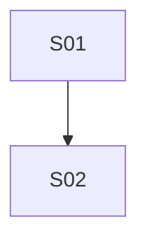

# 流程与功能对齐 — lab-management-system-vue

> 人填、人评审。机器只检查引用的功能 ID 是否存在。
> 评审时把流程图投出来，逐行念「这一步靠哪些功能完成」。念不出来的行，
> 要么流程是空的，要么功能是缺的。这就是对齐的全部意义。

## FLOW-01 （主流程名）

| 步骤 | 名称 | 角色 | 输入 | 输出 | 状态流转 | 支撑功能子项 |
|---|---|---|---|---|---|---|
| S01 | | | | | | |

### 评审时问这四个问题

1. 有没有哪个步骤的「支撑功能子项」是空的？→ 功能缺失，或这一步不该存在
2. 有没有功能子项从头到尾没出现在任何流程里？→ 见下方孤儿清单
3. 状态流转列里的状态名，和代码里的枚举一致吗？→ 不一致就是两套真相
4. 退回路径都画了吗？→ 只画正向流程，会漏掉一半功能

### 孤儿功能

不在任何流程里但合法的功能。**没解释的孤儿 = 没人要的功能。**

| 功能 ID | 为什么合法 |
|---|---|
| M01.F04.I01 | 动态菜单下发：useBackendMenus 拉 lab 后端 /api/auth/menus（ADR-0009），AppShell sidebar 数据源 |
| M01.F04.I02 | 动态权限集；路由守卫前置 (M01.F04.I03) |
| M01.F04.I03 | 客户端路由守卫（composable；无 token 时跳 /login） |
| M01.F05.I02 | axios 拦截器：在 baseURL = getBaseUrl() 上自动跑；注入 Bearer token |
| M01.F05.I03 | SSO 统一登录：跳 saas /login 拿 token 回 /login |
| M01.F05.I04 | 登出：侧栏 logout 按钮 → POST /api/auth/logout |
| M02.F01.I01 | 合同管理是上游资源池，所有接样单通过 contractId 引用；不参与流程转换 |
| M02.F01.I02 | 同上（合同新建/编辑） |
| M02.F01.I03 | 同上（合同删除；与试验流程解耦） |
| M03.F01.I01 | 试验流程 S01 接样 — 列表 |
| M03.F01.I02 | 试验流程 S01 接样 — 新建/编辑 |
| M03.F01.I03 | 试验流程 S01 接样 — 删除 |
| M03.F01.I04 | 试验流程 S01 接样 — 提交（receiving → submitted） |
| M03.F01.I07 | 试验流程 S01 接样 — ext 字段补录（SampleExtFieldsModal stub，react 主仓实装完整） |
| M03.F02.I01 | 试验流程 S02 任务分配 — 列表 |
| M03.F02.I02 | 试验流程 S02 任务分配 — 安排/编辑 assignee |
| M03.F03.I01 | 试验流程 S03 数据录入 — page header 多 endpoint 拉取 |
| M03.F03.I02 | 试验流程 S03 数据录入 — 弹窗内 保存（创建/更新 test_records） |
| M03.F03.I03 | 试验流程 S03 数据录入 — verdict 改判（本地状态，进入 M03.F03.I02 save 时落库） |
| M03.F05.I01 | 试验流程 S04 报告审核 — 队列 |
| M03.F05.I02 | 试验流程 S04 报告审核 — 批量 通过/退回 |
| M03.F06.I01 | 试验流程 S05 报告批准 — 队列 |
| M03.F06.I02 | 试验流程 S05 报告批准 — 批量 通过/退回 |
| M03.F07.I01 | 试验流程 S06 报告发放 — 队列 |
| M03.F07.I02 | 试验流程 S06 报告发放 — 批量 发放/退回 |
| M03.F08.I01 | 试验流程 S07 报告归档 — 队列 |
| M03.F08.I02 | 试验流程 S07 报告归档 — 批量 归档完成/退回 |
| M03.F09.I01 | 试验流程 S08 详情查看 — 详情 card |
| M03.F09.I02 | 试验流程 S08 详情查看 — 流程历史 card |
| M03.F09.I03 | 试验流程 S08 详情查看 — 报告预览 button |
| M04.F06.I01 | M04 字典维护 — 型号 list（FLOW-02 S01） |
| M04.F06.I02 | M04 字典维护 — 型号 新建/编辑（FLOW-02 S02 + S04） |
| M04.F06.I03 | M04 字典维护 — 型号 删除（FLOW-02 S05） |
| M04.F07.I01 | M04 字典维护 — 规格 list（FLOW-02 S01） |
| M04.F07.I02 | M04 字典维护 — 规格 新建/编辑（FLOW-02 S02 + S04） |
| M04.F07.I03 | M04 字典维护 — 规格 删除（FLOW-02 S05） |
| M04.F08.I01 | M04 字典维护 — 等级 list（FLOW-02 S01） |
| M04.F08.I02 | M04 字典维护 — 等级 新建/编辑（FLOW-02 S02 + S04） |
| M04.F08.I03 | M04 字典维护 — 等级 删除（FLOW-02 S05） |
| M04.F09.I01 | M04 字典维护 — 牌号 list（FLOW-02 S01） |
| M04.F09.I02 | M04 字典维护 — 牌号 新建/编辑（FLOW-02 S02 + S04） |
| M04.F09.I03 | M04 字典维护 — 牌号 删除（FLOW-02 S05） |
| M05.F01.I01 | 试验报告汇总：按 categoryCode 聚合 sample_receipts；流程末端读视图，不参与状态流转 |
| M05.F01.I02 | 仪表盘聚合：跨 sample_receipts/contracts 计数 + 3 桶 + pendingTask；只读 |
| M06.F01.I01 | M06 字典子域 — 专项 list（FLOW-02 S06） |
| M06.F02.I01 | M06 字典子域 — 项目 list（FLOW-02 S06） |
| M06.F02.I02 | M06 字典子域 — 项目 新建/编辑（FLOW-02 S06） |
| M06.F03.I01 | M06 字典子域 — 参数 list（FLOW-02 S06） |
| M06.F03.I02 | M06 字典子域 — 参数 关联标准（FLOW-02 S07） |
| M06.F04.I01 | M06 字典子域 — 标准 list（FLOW-02 S06） |
| M06.F04.I02 | M06 字典子域 — 标准 CRUD（FLOW-02 S06） |
| M06.F05.I01 | M06 字典子域 — 计算方法 list（FLOW-02 S03） |
| M06.F06.I01 | M06 字典子域 — 技术要求 list（FLOW-02 S03） |
| M06.F06.I02 | M06 字典子域 — 技术要求 新建/编辑 |
| M06.F06.I03 | M06 字典子域 — 技术要求 删除 |
| M06.F07.I01 | M06 字典子域 — 报告名称 list（FLOW-02 S06） |
| M06.F07.I02 | M06 字典子域 — 报告名称 关联 button（FLOW-02 S07） |
| M06.F08.I01 | M06 字典子域 — 参数界面 list（FLOW-02 S06） |
| M98.F01.I01 | 运行时后端切换 UI 下拉（infra 切面：选择 msw/aspnetcore/springboot/nextjs 之一） |
| M98.F01.I02 | baseURL 持久化到 localStorage[lab.backend]（infra 状态；useBackendStore.setBaseUrl） |
| M98.F02.I01 | axios 拦截器在 baseURL = getBaseUrl() 上自动跑（infra 副作用，不参与业务流程） |
| M98.F03.I01 | orval 生成的认证端点 validation smoke test（infra 验证） |

---

## FLOW-02 （异常流程名）

> 异常流程单独成表，否则它承载的功能永远是孤儿。
